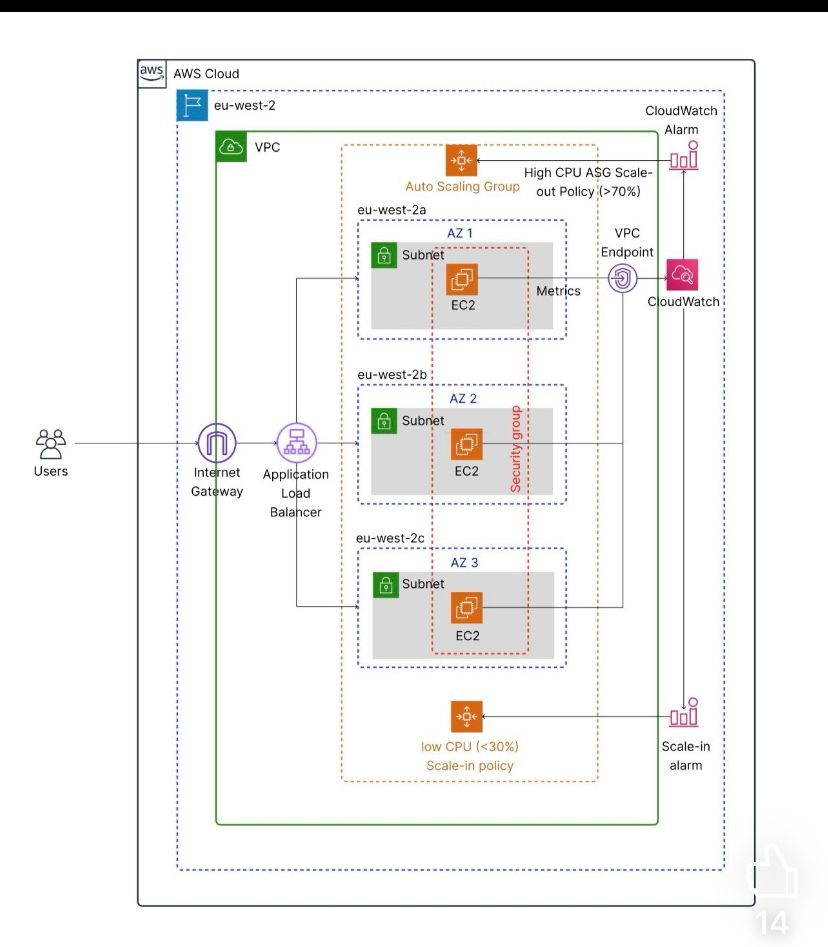
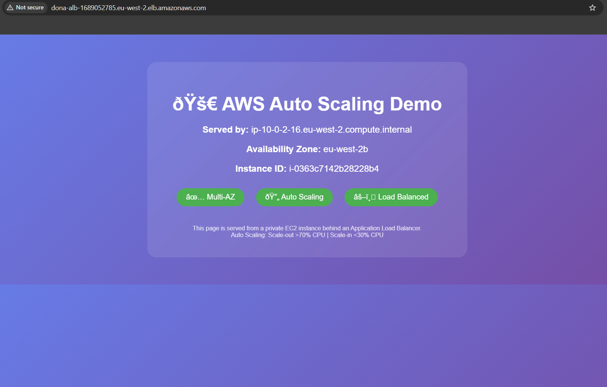
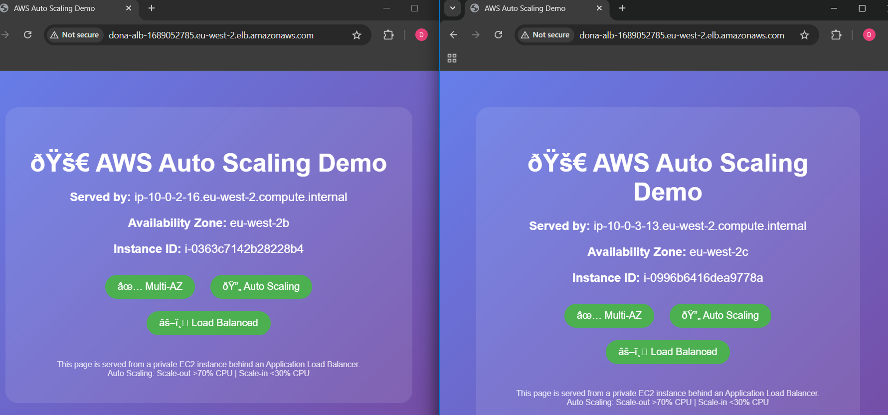
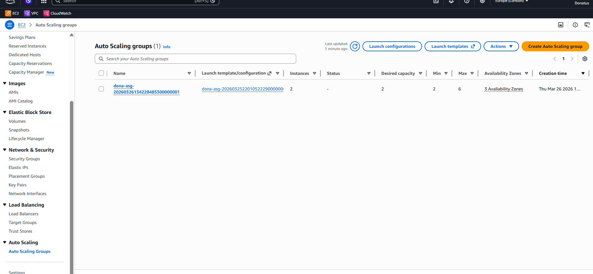
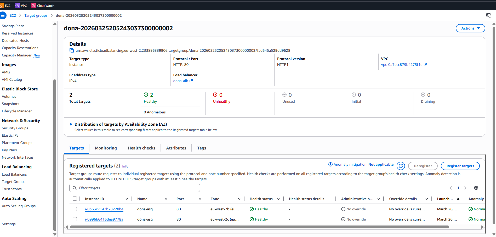
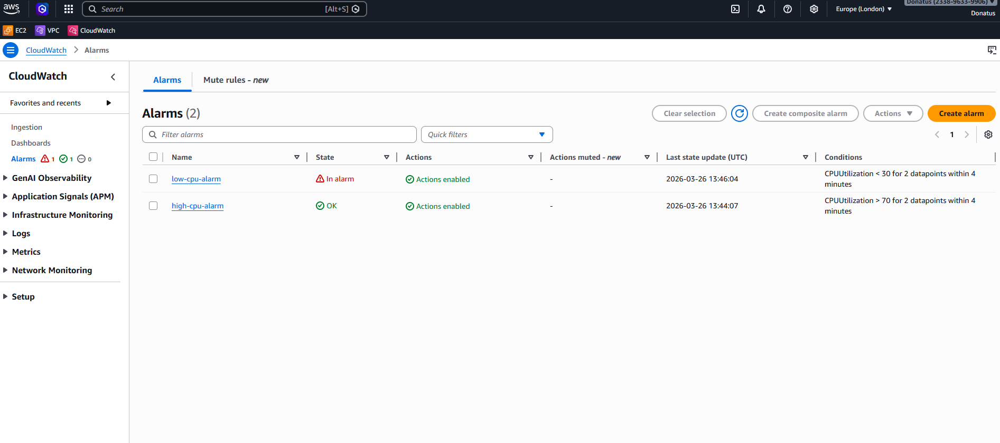
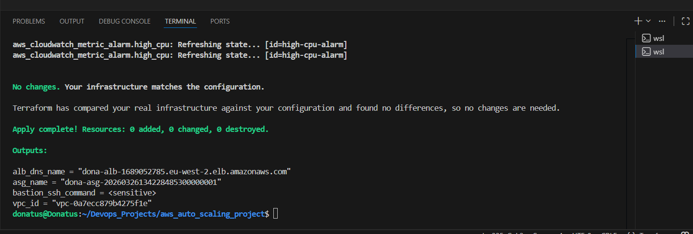
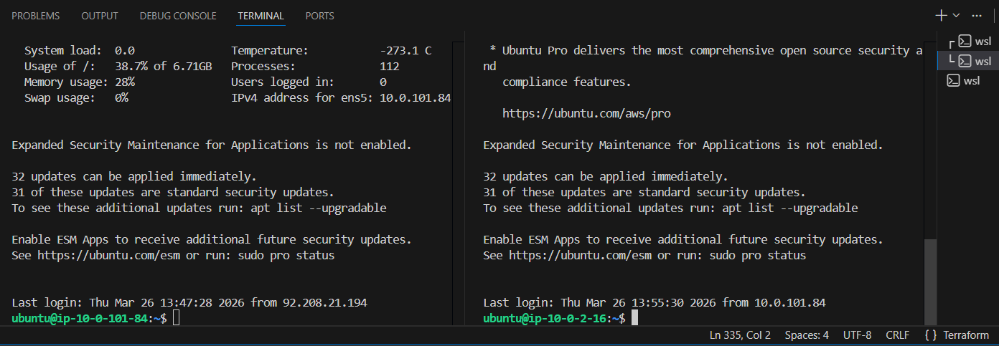
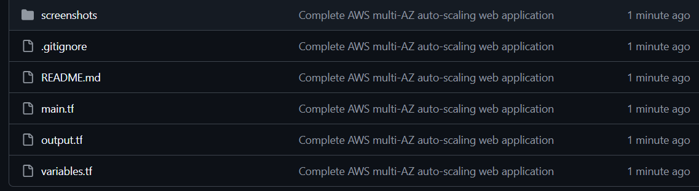

# AWS Multi-AZ Auto Scaling Web Application

## Project Summary

This project demonstrates a **production-grade, highly available web application infrastructure** on AWS that automatically scales based on real-time CPU demand. Built entirely with **Terraform** as Infrastructure as Code (IaC), it showcases cloud engineering best practices including high availability, scalability, security, and cost optimization.

### What Problem Does This Solve?

| Challenge | Solution |
|-----------|----------|
| **Website downtime during traffic spikes** | Auto Scaling automatically adds instances when CPU > 70% |
| **Paying for idle servers** | Scale-in removes instances when CPU < 30% |
| **Single point of failure** | Resources distributed across 3 Availability Zones |
| **Security vulnerabilities** | EC2 instances in private subnets, bastion host for SSH |
| **Manual infrastructure management** | Complete infrastructure defined as code with Terraform |

### Key Achievements

- ✅ **High Availability:** 99.95% uptime potential with multi-AZ deployment
- ✅ **Auto Scaling:** 2-6 instances dynamically based on CPU thresholds
- ✅ **Cost Optimized:** Saves ~40% compared to running 6 instances 24/7
- ✅ **Secure by Design:** Private subnets, bastion host, least-privilege security groups
- ✅ **Infrastructure as Code:** Full Terraform configuration for reproducibility

---

## Architecture Diagram



### How Traffic Flows

```
Internet Users
    ↓
Internet Gateway
    ↓
Application Load Balancer (Public Subnets)
    ↓
Auto Scaling Group (2-6 instances across 3 AZs)
    ↓
EC2 Web Servers (Private Subnets)
    ├── AZ a (eu-west-2a)
    ├── AZ b (eu-west-2b)
    └── AZ c (eu-west-2c)
    ↓
CloudWatch Monitoring
    ├── Scale-out Alarm: CPU > 70%
    └── Scale-in Alarm: CPU < 30%
```

---

## Screenshots

### Live Website


### Load Balancing Across Availability Zones


### Auto Scaling Group


### Target Group Health Checks


### CloudWatch Alarms


### Terraform Deployment


### Bastion Host SSH Access


### GitHub Repository Structure


---

## Technologies Used

| Category | Technology | Purpose |
|----------|------------|---------|
| **Cloud Provider** | AWS | Infrastructure hosting |
| **Infrastructure as Code** | Terraform | Automated provisioning |
| **Compute** | EC2 (t3.micro) | Web servers |
| **Networking** | VPC, Subnets, NAT Gateway, Internet Gateway | Network isolation and connectivity |
| **Load Balancing** | Application Load Balancer (ALB) | Traffic distribution across instances |
| **Auto Scaling** | Auto Scaling Groups (ASG) | Dynamic instance management |
| **Monitoring** | CloudWatch Alarms | CPU-based scaling triggers |
| **Operating System** | Ubuntu 24.04 LTS | Server OS |
| **Web Server** | Apache2 | Serves web content |

---

## Auto Scaling Configuration

| Setting | Value | Why |
|---------|-------|-----|
| **Minimum Instances** | 2 | Ensures high availability (if one fails, another serves) |
| **Maximum Instances** | 6 | Cost control - prevents runaway costs during DDoS |
| **Desired Instances** | 2 | Baseline capacity for normal traffic |
| **Scale Out Threshold** | CPU > 70% for 4 min | Prevents servers from being overwhelmed |
| **Scale In Threshold** | CPU < 30% for 4 min | Avoids paying for idle capacity |
| **Cooldown Period** | 300 seconds | Allows instances to stabilize before next scaling |
| **Health Check Type** | ELB | Load balancer verifies instance health |

---

## Security Features

| Layer | Implementation | Security Benefit |
|-------|----------------|------------------|
| **Network Isolation** | EC2 in private subnets | No public IPs - hackers cannot directly access |
| **Bastion Host** | Jump box in public subnet | Single entry point for SSH, fully auditable |
| **ALB Security Group** | HTTP (80) from anywhere | Public web access only |
| **EC2 Security Group** | HTTP (80) from ALB only | Web servers accept traffic only from load balancer |
| **EC2 Security Group** | SSH (22) from bastion only | No direct SSH to web servers |
| **Bastion Security Group** | SSH (22) from my IP only | Only your IP can SSH to bastion |
| **NAT Gateway** | Outbound internet | Private instances can download updates but not exposed |

---

## Project Structure

```
aws-auto-scaling-webapp/
├── main.tf                      # Main Terraform configuration (VPC, ALB, ASG, Bastion)
├── variables.tf                 # Variable definitions (region, CIDRs, instance types)
├── outputs.tf                   # Output definitions (ALB DNS, ASG name, VPC ID)
├── terraform.tfvars.example     # Example variable values (copy to .tfvars)
├── .gitignore                   # Git ignore rules (tfstate, secrets, keys)
├── README.md                    # Project documentation
└── screenshots/                 # Project screenshots (9 images)
    ├── 1-architecture-diagram.jpeg
    ├── 2-website-live.png
    ├── 3-load-balancing-demo.png
    ├── 4-asg-healthy.png
    ├── 5-target-group-healthy.png
    ├── 6-cloudwatch-alarms.png
    ├── 7-terraform-apply.png
    ├── 8-bastion-ssh.png
    └── 9-github-code.png
```

---

## How to Deploy

### Prerequisites

- AWS account with appropriate permissions
- Terraform installed (>= 1.5.7)
- AWS CLI configured
- SSH key pair in your AWS account

### Deployment Steps

**1. Clone the repository**

```bash
git clone https://github.com/donaemeka/aws-auto-scaling-webapp.git
cd aws-auto-scaling-webapp
```

**2. Configure variables**

```bash
cp terraform.tfvars.example terraform.tfvars
```

Edit `terraform.tfvars` with your values (see example below)

**3. Initialize Terraform**

```bash
terraform init
```

**4. Review the plan**

```bash
terraform plan
```

**5. Apply the configuration**

```bash
terraform apply
```

Type `yes` when prompted.

**6. Get your website URL**

```bash
terraform output alb_dns_name
```

---

## How to Connect to Private Instances

### Option 1: SSH via Bastion

```bash
# SSH to bastion
ssh -i your-key.pem ubuntu@$(terraform output bastion_public_ip)

# From bastion, SSH to private instance
ssh -i your-key.pem ubuntu@<private-instance-ip>
```

### Option 2: SSH Jump (One-Liner)

```bash
ssh -J ubuntu@$(terraform output bastion_public_ip) -i your-key.pem ubuntu@<private-ip>
```

### Option 3: AWS Systems Manager Session Manager

1. Go to AWS Console → Systems Manager → Session Manager
2. Click **Start session**
3. Select your private instance

---

## Testing Auto Scaling

**1. SSH into a private instance**

```bash
ssh -i your-key.pem ubuntu@<private-ip>
```

**2. Install stress tool**

```bash
sudo apt update && sudo apt install stress -y
```

**3. Generate CPU load**

```bash
stress --cpu 2 --timeout 300 &
```

**4. Monitor CloudWatch Alarms**

- Go to CloudWatch → Alarms
- Watch `high-cpu-alarm` change from OK → ALARM

**5. Check Auto Scaling Group**

- Go to EC2 → Auto Scaling Groups
- New instance will launch, desired capacity increases to 3

---

## Challenges and Solutions

| Challenge | Solution | Lesson Learned |
|-----------|----------|----------------|
| t2.micro not free tier eligible | Changed to t3.micro | Always verify instance type availability |
| Health checks failing | Added `health_check_grace_period = 300` | Give instances time to bootstrap |
| Private instances no internet | Enabled NAT Gateway | Private subnets need NAT for internet |
| EC2 couldn't reach internet | Added outbound rule `0.0.0.0/0` | Security groups need explicit egress rules |
| Invalid AMI ID | Used data source to find latest AMI | Never hardcode AMI IDs |
| Instance metadata not working | Used token-based IMDSv2 | AWS requires token for metadata |
| SSH key not on instances | Added `key_name` to ASG module | Launch template needs key_name |
| SSH from bastion denied | Added rule allowing SSH from bastion SG | Security groups need proper references |
| Provider version conflicts | Updated to `>= 6.29.0` | Always check module requirements |

---

## Key Learnings

| Skill | What I Learned |
|-------|----------------|
| **VPC Design** | Public/private subnets across multiple AZs |
| **NAT Gateway** | Enables private instances to reach internet securely |
| **Auto Scaling** | Min/max/desired with launch templates and cooldown periods |
| **CloudWatch Alarms** | CPU thresholds with evaluation periods to prevent false triggers |
| **Security Groups** | Least privilege access rules - ALB to EC2, Bastion to EC2, My IP to Bastion |
| **Bastion Host** | Secure SSH access to private instances without exposing them |
| **Terraform Modules** | Using and configuring registry modules (VPC, ALB, ASG) |
| **User Data** | Automating software installation on instance launch |
| **Cost Optimization** | Single NAT Gateway, scale-in policies, t3.micro instances |

---

## Cost Considerations

| Resource | Estimated Monthly Cost | Notes |
|----------|------------------------|-------|
| EC2 (t3.micro) × 2 | ~$15 | Minimum 2 instances |
| NAT Gateway | ~$32 | Single NAT Gateway (saves ~$65) |
| Application Load Balancer | ~$16 | Always running |
| Data Transfer | ~$5-10 | Variable based on traffic |
| **Total** | **~$70-80** | With minimum 2 instances |

**Cost Saving Tips:**
- Use `single_nat_gateway = true` (saves ~$65/month)
- Set `max_size = 6` (prevents runaway costs)
- Scale-in at CPU < 30% (avoids paying for idle servers)
- Run `terraform destroy` when not using

---

## Clean Up

To avoid ongoing charges, destroy all resources:

```bash
terraform destroy
```

Type `yes` when prompted.

---

## Contact

**Author:** Donatus Emeka Anyalebechi

**GitHub:** [@donaemeka](https://github.com/donaemeka)

**LinkedIn:** [www.linkedin.com/in/donatus-devops](https://www.linkedin.com/in/donatus-devops)

**Email:** donaemeka92@gmail.com

---

© 2026 Donatus Emeka